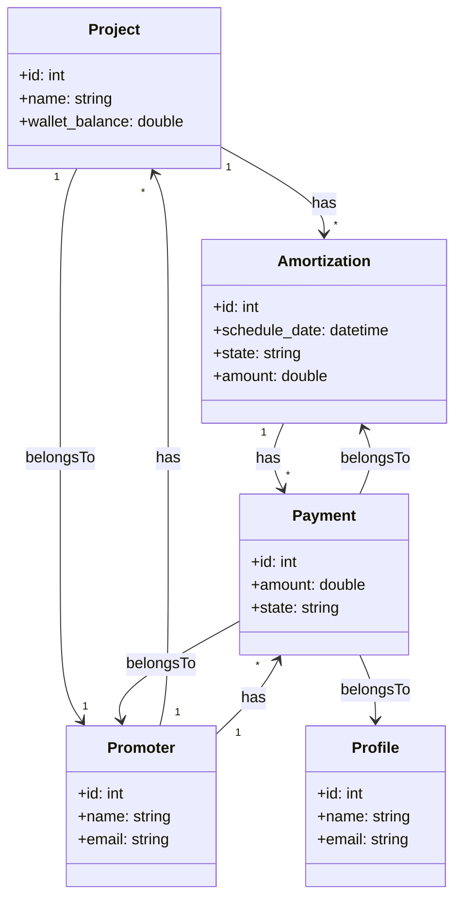

# Laravel Payment Processing

This project implements a payment system that processes amortizations and payments, ensuring that payments are correctly handled.

## Assumptions

-   You have Docker and Docker-compose installed on your system. [Check Laravel's instructions for each OS](https://laravel.com/docs/10.x#laravel-and-docker)

-   The project wallet can never be negative
-   The date that will be checked to see if an Amortization is overdue is being calculated at runtime, and will be the current date and time of the execution.

## Database Relations

-   Each Amortization is associated with one Project.
-   Each Amortization can have multiple Payments associated with it.
-   Each Payment is associated with one Amortization.
-   Each Payment is associated with one Profile.
-   Each Payment is associated with one Promoter.
-   Each Profile can have multiple Payments associated with it.
-   Each Project can have multiple Amortizations associated with it.
-   Each Project is associated with one Promoter.
-   Each Promoter can have multiple Projects associated with it.
-   Each Promoter can have multiple Payments associated with it.

## Setup

This project is built with [Sail](https://laravel.com/docs/10.x/sail), a light-weight command-line interface for interacting with Laravel's default Docker development environment.

## Useful commands

`alias sail='[ -f sail ] && sh sail || sh vendor/bin/sail'`

`sail artisan migrate`

`sail up -d`

The migrate:fresh command will drop all tables from the database and then execute the migrate command:

`sail artisan migrate:fresh`

`sail artisan migrate:fresh --seed`

To run the queue on the database:

add this to the `.env` file `QUEUE_CONNECTION=database`
`sail artisan queue:table`

`sail artisan migrate`

`sail artisan queue:work redis`

`./vendor/bin/sail composer require predis/predis` - to install predis

`sail down`

`sysctl vm.overcommit_memory=1`

`sail artisan queue:work redis --max-jobs=100`

## Performance

**Note:** In this code, we are not using chunk. If you have a very large number of amortizations to process, and you want to use chunk to reduce the memory usage, you can modify the code to create a batch of jobs for each chunk and dispatch them separately. However, this will create multiple batches, and you will need to handle the completion and failure of each batch separately.

## Inspiration

[Table Pagination](https://tailwindui.com/components/application-ui/navigation/pagination)
