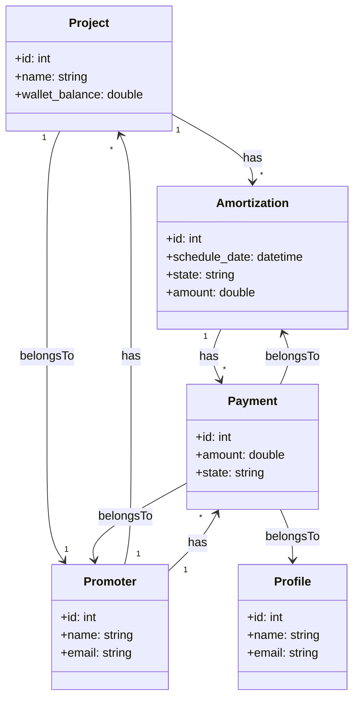

<p align="center"><a href="https://laravel.com" target="_blank"></a></p>

# Laravel Payment Processing

This project implements a payment system that processes amortizations and payments, ensuring that payments are correctly handled.

## Assumptions

-   You have Docker and Docker-compose installed on your system. [Check Laravel's instructions for each OS](https://laravel.com/docs/10.x#laravel-and-docker)
-   The project wallet can never be negative
-   The date that will be checked to see if an Amortization is overdue is being calculated at runtime, and will be the current date and time of the execution.
-   An Amortization can only have two states: `pending` and `paid`.
-   An amortization is considered `paid` only when its corresponding payment is successfully processed, and the amortization's state is updated from `pending` to `paid`.

## Setup

### Setting Up The Project

This project is built with [Sail](https://laravel.com/docs/10.x/sail), a light-weight command-line interface for interacting with Laravel's default Docker development environment.

Sail is a dependency of Laravel, as is installed in the `vendor/bin` directory. Therefore, to execute it, we would have to write a lot. So we create an alias to execute it with the command `sail`

Run this command to start:

```console
alias sail='[ -f sail ] && sh sail || sh vendor/bin/sail'
```

Now we are ready to bring our containers up. Run this command to initialize the project. It might take some time to download everything.

```console
sail up
```

To start all containers in the background, run:

```console
sail up -d
```

Now we want to create the tables.

The `migrate:fresh` command will drop all tables from the database and then execute the migrate command. The `--seed` command will use the seed data.

```console
sail artisan migrate:fresh --seed
```

### Setting Up The Amortizations Page

Having done all the steps in [Setting Up The Project](#setting-up-the-project), we can already check the
`localhost/amortizations` page in our browser.

We'll be able to:

-   See all the amortizations in the system
-   Sort each column in ascending or descending order
-   Set different page sizes
-   Check each page with pagination.

### Running the Queue

To handle all the payment processing, we're using a Queue. This allows for each API call to be super fast. Therefore, if there are millions of users calling our API, we can handle all the requests efficiently: the queue will process all the jobs on the background, asynchronously.

To have our qeueu running and able to process jobs, run this command:

```console
sail artisan queue:work redis
```

If there are any jobs, the queue will process them. If there are no more jobs, the queue will still be listening and waiting for more jobs to come.

If you want to start the queue with a limit to the number of jobs it should run - it may be useful for testing and to see what is actually going on - use:

```console
sail artisan queue:work redis --max-jobs=100`
```

:warning: **NOTE:** I had memory issues when trying to run my queue - i'm using Ubuntu 22.04 in WSL2. If you find the same problem, run this command:

```console
sysctl vm.overcommit_memory=1
```

It sets the memory overcommit behavior to allow all memory allocations, regardless of the current status of memory.

For more Queue options, visit [Laravel's official documentation](https://laravel.com/docs/10.x/queues#main-content)

### Shutting Down

If you have the [Queue running](#running-the-queue), don't forget to terminate it using `Ctrl + C`.

To shutdown, simply run the command:

```console
sail stop
```

If you want to start off with fresh containers, with a clean cache, and keeping all data, run:

```console
sail down
```

## API

After you [Setup](#setup) everything, you can fully use the software.

### Pay All Due Amortizations

In this endpoint, we issue the command for the server to start processing the amortizations. This endpoint returns a `batch_id`.

Here's a curl request to use it:

```curl
curl --location 'http://localhost:80/api/v1/pay-all-due-amortizations'
```

### Check Batch Status

This endpoint allows us to check the status of the batch with a specific id. To get a valid id, check the [Pay All Due Amortizations](#pay-all-due-amortizations). This endpoint returns an object with data on the jobs executing for that specific batch.

Here's a curl request to use it:

```curl
curl --location 'http://localhost:80/api/v1/check-batch-status/' \
--form 'batch_id="9a29a0cc-0076-4106-ae47-8cc8643ff29a"'
```

### Get All Amortizations

This endpoint returns all the amortizations. It allows for four arguments:

-   `page`: the page number you want. Default is `1`.
-   `per_page`: the number of elements per page. Default is `10`.
-   `order`: the sorting order for a column. Can be `asc` or `desc`. Default is `asc`.
-   `sort_by`: the column on which to sort. Default is `id`.

This is the endpoint called by the Amortizations Page, served at `http://localhost/amortizations`

Here's a curl request to use it:

```curl
curl --location 'http://localhost/api/v1/index?page=3&per_page=50&order=desc&sort_by=schedule_date'
```

## Database Relations

-   Each Amortization is associated with one Project.
-   Each Amortization can have multiple Payments associated with it.
-   Each Payment is associated with one Amortization.
-   Each Payment is associated with one Profile.
-   Each Payment is associated with one Promoter.
-   Each Profile can have multiple Payments associated with it.
-   Each Project can have multiple Amortizations associated with it.
-   Each Project is associated with one Promoter.
-   Each Promoter can have multiple Projects associated with it.
-   Each Promoter can have multiple Payments associated with it.



## Containers

We have 6 containers in total:

1. The server for the app
2. MySql database
3. PhpMyAdmin database UI, available at `http://localhost:8080`
4. Mailpit, which allows us to view the email notifications that will be sent. Available at `http://localhost:8025/`
5. Redis, which handles the queues.
6. Redis Commander, a Redis UI. Available at `http://localhost:6379/`

## Basic Architecture and Performance

There are three main parts in this solution.

### Controller

Handles the API requests and delegates computation to the [service](#service)

### Service

The service handles the necessary queries and dispatches jobs to execute in the background.

### Job

The job handles the actual work of verifying if an amortization is due and if it can be successfully paid. It runs asynchronously, and each amortization has a dedicated job.

### Performance

In this solution we are using jobs, one for each Amortization to be processed, and another for each email notification to be sent. This allows for processing information asynchronously, on background processes.

This allows for an API call to have a response in `milliseconds`, whilst the background process can take `minutes`. For servers with millions of requests and users, this is a good approach.

For each request to the [pay-all-due-amortizations](#pay-all-due-amortizations) endpoint, the service will create an array of jobs, and these jobs will then be [Batched](https://laravel.com/docs/10.x/queues#job-batching).

<!-- #### Tradeoff

There could still be an upgrade to performance to this solution: we could retrive data from the database in smaller chunks
However, we are not using chunk. If you have a very large number of amortizations to process, and you want to use chunk to reduce the memory usage, you can modify the code to create a batch of jobs for each chunk and dispatch them separately. However, this will create multiple batches, and you will need to handle the completion and failure of each batch separately. -->

## Inspiration

[Table Pagination](https://tailwindui.com/components/application-ui/navigation/pagination)
